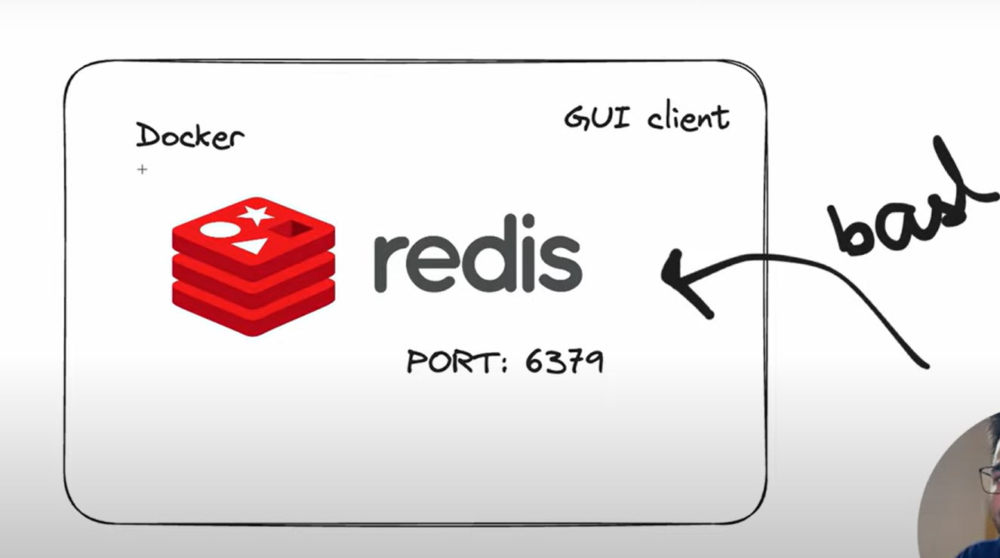
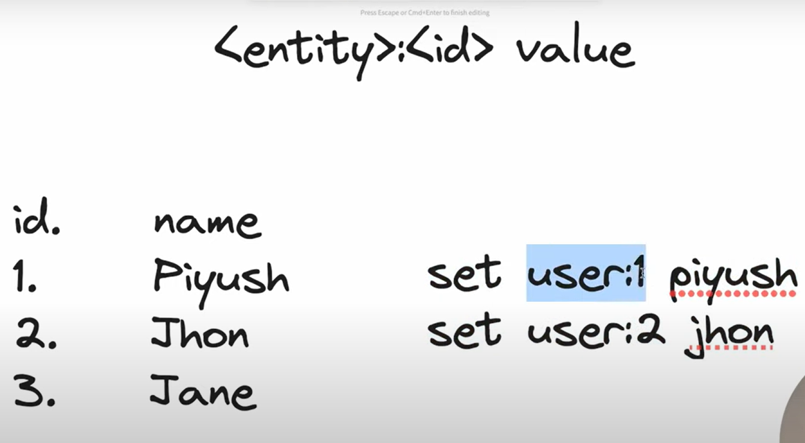

# Redis

- more kind of NoSQL db
- diff than SQL db

- Best for storing JSON data. (Key, Value) pairs

- Stores data on RAM | not persistence
- therefore, more oftenly used for caching

- Seats on top of tradinal db that means one can cache more often data to increase the speed.

- The setup
  

- Convention to write Key, Value
  

## Install

- EASY on mac and linux
- have to use WSL (windows subsystem for linux) for windows

### cmds to install wsl:

```bash
$wsl --install

$wsl --list --online

$wsl --install -d <DistroName>
```

### Install Redis

```bash

sudo apt-get update

sudo apt-get install redis

redis-server

redis-cli  #(in the next tab)
```

## How to get started

First spin up a terminal and start the redis server
```bash
redis-cli
```
Then, navigate to 2_server.js and start it
```bash
node 2_server.js
```
To stop the redis server
```bash
redis-cli shutdown
```

## Commands

### <u>Strings</u>

1. set entity:key value
2. SETNX - stores a string value only if the key doesn't already exist. Useful for implementing locks.
3. get key // values are always stored as a string in redis
4. mget - multitple get
5. del key
6. exists key
7. keys \* // cmd to find all the keys in db
8. flushall // clears everything from the db

- Handling Expirations

7. ttl name // outputs the time to live value of that particular key
   - op: -1 leaves forever
8. expire key 10 // 10 is the time in seconds to live
   - op: -2 it is deleted | gone
9. setex key time value
10. counter: used to check how many people visited the website
    - set cnt value;
    - incr key
    - incrby key value

### <u>Lists(Array)</u>

- can also be used as STACK and QUEUES.

1. Add an item (lpush - left/start push)

- lpush key value

2. Add an item (rpush - right/end push)

- rpush key value

3. Print the values of list/array

- lrange key start_pos end_pos

4. pop out elements

- lpop key/rpop key

5. Length of the list

- llen key

6. Blocking POP, wait till the specified time to pop an element provided the list is empty; else works as normal pop

- blpop key time

### <u>Sets(Unique Array)</u>

1 Add an item in a set

- SADD KEY VALUE

  2.Remove an item

- SREM KEY VALUE

  3.Print all values

- SMEMBERS KEY

### <u>Hashes</u>

- Kind of like JSON Object obj{ {key-val},{key-va} }

1. Add

- HSET key field value

2. Remove

- HDEL key field

3. Exists

- HEXISTS KEY FIELD

4. Print

- HGETALL key

### <u>Sorted Sets (Priority Queue)</u>

- sorted and ordered
- each key has a priority associated with it.
- prefix used is 'z'

1. Add

- zadd key rank value

2. print

- zrange key start_pos end_pos

3. reverse print

- zrevrange key 0 -1

4. rank of given value // ranking starts form 0

- zrank key value

### <u>Redis Streams</u>

Continuous data generation per unit of time

- Event sourcing (e.g., tracking user actions, clicks, etc.)
- Sensor monitoring (e.g., readings from devices in the field)
- Notifications (e.g., storing a record of each user's notifications in a separate stream)

### <u>Geospatial Data</u>

Redis geospatial indexes let you store coordinates and search for them. This data structure is useful for finding nearby points within a given radius or bounding box.
Input as:

- Longitude
- Lattitude
- Radius

GEOADD

- GEOADD KEY FROMLANLAT LANG_DATA LAT_DATA BYRADIUS RAD_DATA WITHDIST

GEOSEARCH

### <u>BITMAPS</u>

- SENSOR'S DATA

### <u>TIMESERIES</u>

- STOCKS

## Pub/Sub

Publish/Subscibe/Unsubscribe
